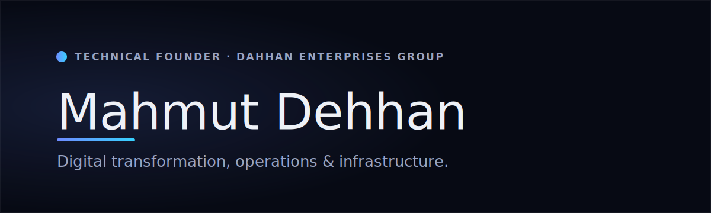

  

  
  
  

## Mahmut Dehhan

**Technical Founder · International Operations · Digital Transformation & Infrastructure Modernization · Manufacturing, B2B Wholesale & Ecommerce Systems.**

I build and operate the **Dahhan Enterprises group** — a family of businesses across manufacturing, B2B wholesale, textiles and e-commerce, together with the technology practice that modernizes them. My work sits where **business strategy meets hands-on technology execution**: turning operations into modern, software-driven, infrastructure-backed company systems.

## What I do

- **Digital transformation & modernization** — strategy through to production, delivered as one accountable lifecycle rather than a hand-off.
- **International operations** — running connected business lines across commerce, textiles, wholesale and e-commerce under one operating model.
- **Infrastructure & platform** — a self-hosted, infrastructure-as-code, observable, fail-closed platform that the group's ventures run on.

Through **M1D0 Technologies**, I lead this work for the group — and for a small number of partner businesses under long-term engagements.

## What I build & operate

The group's public presence lives under the **[M1D0-Technologies](https://github.com/M1D0-Technologies)** organization:

- **[M1D0 Technologies](https://github.com/M1D0-Technologies/m1d0-technologies)** — boutique digital transformation, IT consulting & managed services.
- **[Dahhan Enterprises](https://github.com/M1D0-Technologies/dahhan-enterprises)** — the international business group.
- **[Dahhan Industries](https://github.com/M1D0-Technologies/dahhan-industries)** — industrial textile manufacturing, OEM & B2B wholesale supply.
- **[Miss Dantella](https://github.com/M1D0-Technologies/miss-dantella)** — a house of lace, lingerie and elastic.
- **[FoodAtlas](https://github.com/M1D0-Technologies/foodatlas)** — a food-intelligence platform (in development).

> My product code stays private. What you see here is the story and the work — the products, the approach, and how it's operated — not the source.

## Get in touch

- 🌐 **[m1d0.com](https://www.m1d0.com)**
- ✉️ **contact@m1d0.com**

© 2026 Dahhan Enterprises LLC — M1D0 Technologies, Dahhan Industries, Miss Dantella and affiliated brands. All rights reserved.
