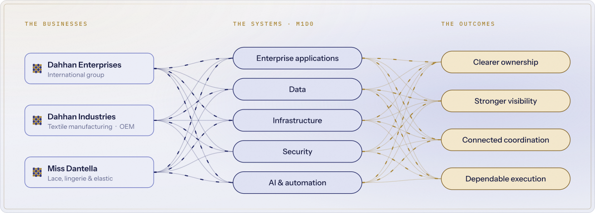
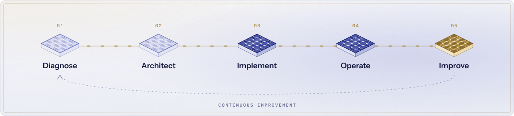

<picture><source media="(prefers-color-scheme: dark) and (max-width: 640px)" srcset="./assets/banner-mobile-dark.svg" /><source media="(max-width: 640px)" srcset="./assets/banner-mobile-light.svg" /><source media="(prefers-color-scheme: dark)" srcset="./assets/banner-dark.svg" /></picture>

<a href="https://www.linkedin.com/in/mahmutdehhan/"><picture><source media="(prefers-color-scheme: dark) and (max-width: 640px)" srcset="./assets/tiles/rail-linkedin-mob-dark.svg" /><source media="(max-width: 640px)" srcset="./assets/tiles/rail-linkedin-mob-light.svg" /><source media="(prefers-color-scheme: dark)" srcset="./assets/tiles/rail-linkedin-desk-dark.svg" /></picture></a><a href="mailto:mahmutdehhan@dahhanenterprises.com"><picture><source media="(prefers-color-scheme: dark) and (max-width: 640px)" srcset="./assets/tiles/rail-email-mob-dark.svg" /><source media="(max-width: 640px)" srcset="./assets/tiles/rail-email-mob-light.svg" /><source media="(prefers-color-scheme: dark)" srcset="./assets/tiles/rail-email-desk-dark.svg" /></picture></a>

Business transformation sits at the intersection of commercial strategy, real-world operations and the systems that connect them.

My work spans international operations, manufacturing, B2B wholesale and ecommerce: how products move, how suppliers and production interact, how customers are served, and where disconnected processes or systems begin to slow the business down.

## Companies & roles

<a href="https://github.com/M1D0-Technologies/dahhan-enterprises"><picture><source media="(prefers-color-scheme: dark) and (max-width: 640px)" srcset="./assets/tiles/co-dahhan-enterprises-mob-dark.svg" /><source media="(max-width: 640px)" srcset="./assets/tiles/co-dahhan-enterprises-mob-light.svg" /><source media="(prefers-color-scheme: dark)" srcset="./assets/tiles/co-dahhan-enterprises-desk-dark.svg" /></picture></a><a href="https://www.dahhanenterprises.com"><picture><source media="(prefers-color-scheme: dark) and (max-width: 640px)" srcset="./assets/tiles/co-dahhan-enterprises-web-mob-dark.svg" /><source media="(max-width: 640px)" srcset="./assets/tiles/co-dahhan-enterprises-web-mob-light.svg" /><source media="(prefers-color-scheme: dark)" srcset="./assets/tiles/co-dahhan-enterprises-web-desk-dark.svg" /></picture></a><a href="https://www.linkedin.com/company/dahhan-enterprises/"><picture><source media="(prefers-color-scheme: dark) and (max-width: 640px)" srcset="./assets/tiles/co-dahhan-enterprises-in-mob-dark.svg" /><source media="(max-width: 640px)" srcset="./assets/tiles/co-dahhan-enterprises-in-mob-light.svg" /><source media="(prefers-color-scheme: dark)" srcset="./assets/tiles/co-dahhan-enterprises-in-desk-dark.svg" /></picture></a>

**International Operations & Business Transformation** · 2015 – Present

- Lead international operations and group-level business transformation across manufacturing, B2B wholesale and ecommerce, aligning commercial priorities, procurement, supplier relationships and international trade.
- Define operating models, process ownership and transformation roadmaps to clarify accountability, strengthen management visibility and turn strategic priorities into coordinated execution across the businesses.

<a href="https://github.com/M1D0-Technologies/dahhan-industries"><picture><source media="(prefers-color-scheme: dark) and (max-width: 640px)" srcset="./assets/tiles/co-dahhan-industries-mob-dark.svg" /><source media="(max-width: 640px)" srcset="./assets/tiles/co-dahhan-industries-mob-light.svg" /><source media="(prefers-color-scheme: dark)" srcset="./assets/tiles/co-dahhan-industries-desk-dark.svg" /></picture></a><a href="https://www.dahhanindustries.com"><picture><source media="(prefers-color-scheme: dark) and (max-width: 640px)" srcset="./assets/tiles/co-dahhan-industries-web-mob-dark.svg" /><source media="(max-width: 640px)" srcset="./assets/tiles/co-dahhan-industries-web-mob-light.svg" /><source media="(prefers-color-scheme: dark)" srcset="./assets/tiles/co-dahhan-industries-web-desk-dark.svg" /></picture></a><a href="https://www.linkedin.com/company/dahhan-industries/"><picture><source media="(prefers-color-scheme: dark) and (max-width: 640px)" srcset="./assets/tiles/co-dahhan-industries-in-mob-dark.svg" /><source media="(max-width: 640px)" srcset="./assets/tiles/co-dahhan-industries-in-mob-light.svg" /><source media="(prefers-color-scheme: dark)" srcset="./assets/tiles/co-dahhan-industries-in-desk-dark.svg" /></picture></a>

**Manufacturing Operations & Digital Transformation** · 2015 – Present

- Lead operational and digital modernization across textile manufacturing, OEM/private-label production and B2B supply, aligning procurement, production, quality and shipment planning with customer commitments.
- Connect production and commercial workflows through structured product, supplier and production data to improve planning, strengthen visibility from sourcing to shipment and reduce fragmented tracking.

<a href="https://github.com/M1D0-Technologies/miss-dantella"><picture><source media="(prefers-color-scheme: dark) and (max-width: 640px)" srcset="./assets/tiles/co-miss-dantella-mob-dark.svg" /><source media="(max-width: 640px)" srcset="./assets/tiles/co-miss-dantella-mob-light.svg" /><source media="(prefers-color-scheme: dark)" srcset="./assets/tiles/co-miss-dantella-desk-dark.svg" /></picture></a><a href="https://www.missdantella.com"><picture><source media="(prefers-color-scheme: dark) and (max-width: 640px)" srcset="./assets/tiles/co-miss-dantella-web-mob-dark.svg" /><source media="(max-width: 640px)" srcset="./assets/tiles/co-miss-dantella-web-mob-light.svg" /><source media="(prefers-color-scheme: dark)" srcset="./assets/tiles/co-miss-dantella-web-desk-dark.svg" /></picture></a><a href="https://www.linkedin.com/company/missdantella/"><picture><source media="(prefers-color-scheme: dark) and (max-width: 640px)" srcset="./assets/tiles/co-miss-dantella-in-mob-dark.svg" /><source media="(max-width: 640px)" srcset="./assets/tiles/co-miss-dantella-in-mob-light.svg" /><source media="(prefers-color-scheme: dark)" srcset="./assets/tiles/co-miss-dantella-in-desk-dark.svg" /></picture></a>

**Commerce & Digital Transformation** · 2015 – Present

- Lead commercial and digital transformation across brand, product, B2B wholesale and ecommerce, aligning positioning, customer experience and sales channels with the business's commercial priorities.
- Connect product, customer and order information across B2B and B2C channels to create a more coherent commercial operation from discovery and enquiry through ordering and fulfilment.

<a href="https://github.com/M1D0-Technologies/m1d0-technologies"><picture><source media="(prefers-color-scheme: dark) and (max-width: 640px)" srcset="./assets/tiles/co-m1d0-mob-dark.svg" /><source media="(max-width: 640px)" srcset="./assets/tiles/co-m1d0-mob-light.svg" /><source media="(prefers-color-scheme: dark)" srcset="./assets/tiles/co-m1d0-desk-dark.svg" /></picture></a><a href="https://www.m1d0.com"><picture><source media="(prefers-color-scheme: dark) and (max-width: 640px)" srcset="./assets/tiles/co-m1d0-web-mob-dark.svg" /><source media="(max-width: 640px)" srcset="./assets/tiles/co-m1d0-web-mob-light.svg" /><source media="(prefers-color-scheme: dark)" srcset="./assets/tiles/co-m1d0-web-desk-dark.svg" /></picture></a><a href="https://www.linkedin.com/company/m1d0/"><picture><source media="(prefers-color-scheme: dark) and (max-width: 640px)" srcset="./assets/tiles/co-m1d0-in-mob-dark.svg" /><source media="(max-width: 640px)" srcset="./assets/tiles/co-m1d0-in-mob-light.svg" /><source media="(prefers-color-scheme: dark)" srcset="./assets/tiles/co-m1d0-in-desk-dark.svg" /></picture></a>

**Founder · Business & Digital Transformation** · 2025 – Present

- Translate business priorities into technology strategy, enterprise architecture and integrated business systems, connecting processes and data so technology strengthens daily operations rather than adding complexity.
- Lead delivery from diagnosis through implementation and ongoing improvement, bringing together specialist expertise, infrastructure, security, AI and automation to build dependable capabilities that evolve with the business.

Divisions and products

| Division | Focus |
| --- | --- |
| **Transformation** | Digital-transformation consulting, technology strategy & architecture roadmaps, fractional CTO |
| **Systems** | Cloud infrastructure, platform engineering, managed IT, observability, data engineering |
| **Digital** | Web platforms & applications, ecommerce & digital presence, UI/UX & design systems |
| **Integrations** | Workflow automation, ERP / CRM & business-process automation |
| **Security** | Identity & access, cybersecurity engineering, continuity & incident readiness |
| **Labs** | Applied AI R&D: prototypes and LLM applications |

**[FoodAtlas](https://github.com/M1D0-Technologies/foodatlas)**, a food-intelligence platform, is in development.

## How I work

<picture><source media="(prefers-color-scheme: dark) and (max-width: 640px)" srcset="./assets/operating-map-mobile-dark.svg" /><source media="(max-width: 640px)" srcset="./assets/operating-map-mobile-light.svg" /><source media="(prefers-color-scheme: dark)" srcset="./assets/operating-map-dark.svg" /></picture>

- **Technology is part of the business.** Every system has to connect back to how decisions are made, how work moves through the organization and how value reaches the customer.
- **One role across the full picture.** Defining direction, shaping architecture, coordinating specialist and AI-assisted execution, integrating the pieces, and staying accountable for how the result performs in real operations.

<picture><source media="(prefers-color-scheme: dark) and (max-width: 640px)" srcset="./assets/lifecycle-mobile-dark.svg" /><source media="(max-width: 640px)" srcset="./assets/lifecycle-mobile-light.svg" /><source media="(prefers-color-scheme: dark)" srcset="./assets/lifecycle-dark.svg" /></picture>

> My product code stays private. What you see here is the story and the work — the businesses, the approach and how they're run — not the source.

© 2026 Dahhan Enterprises LLC. All rights reserved.
