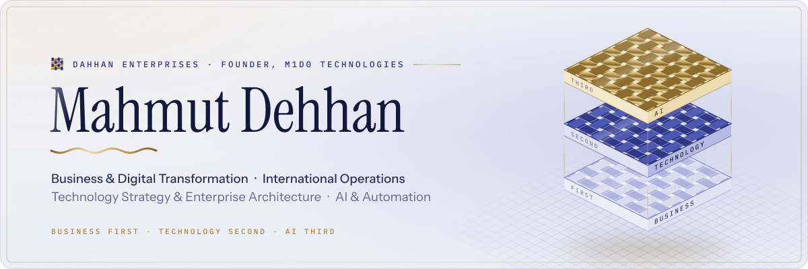
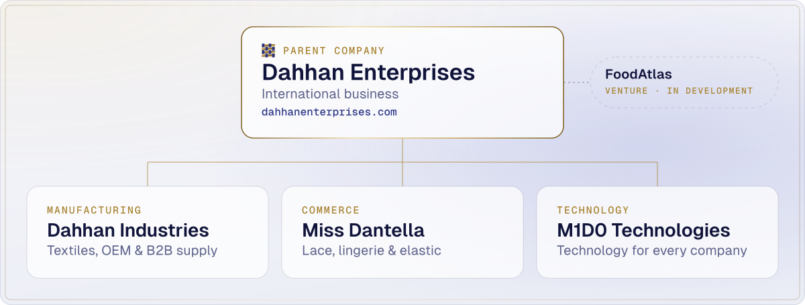
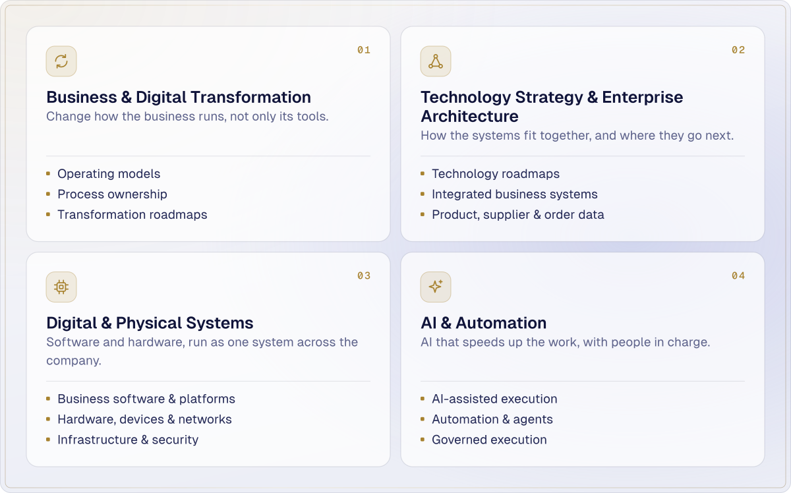
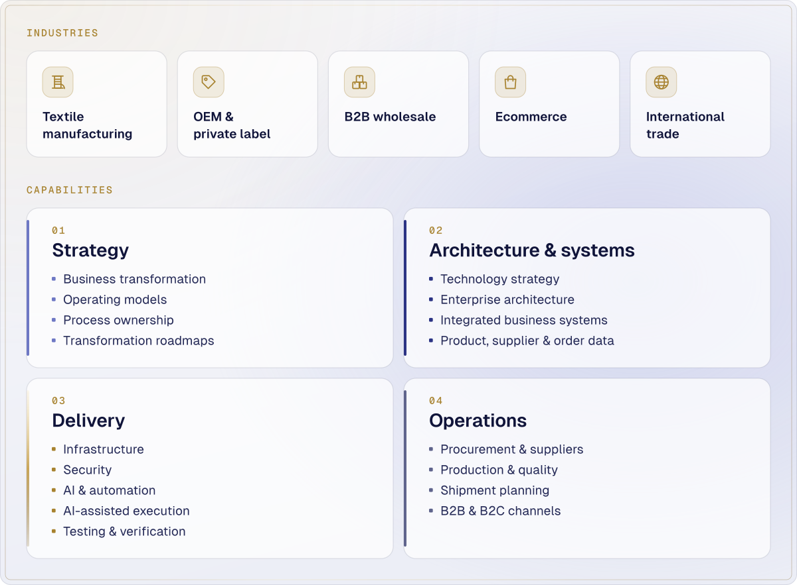
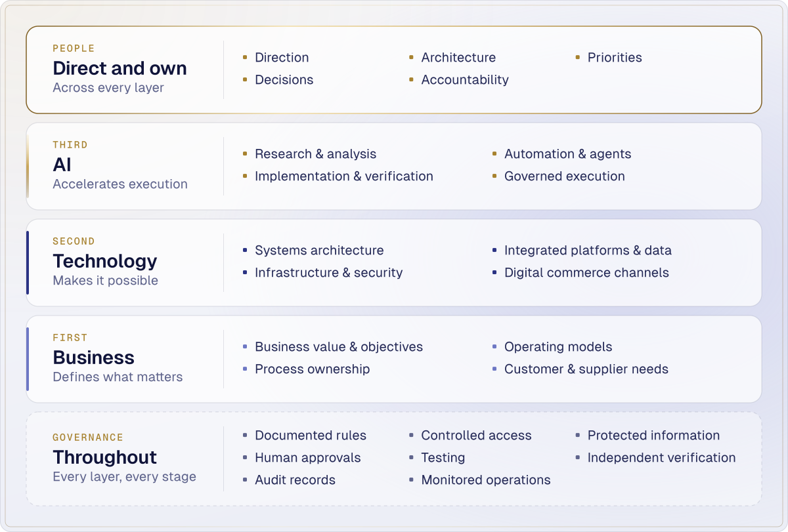
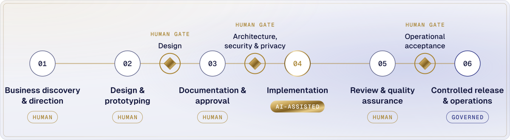
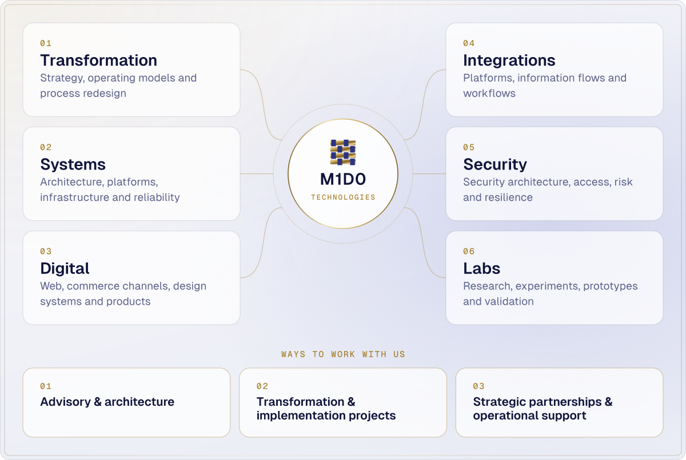
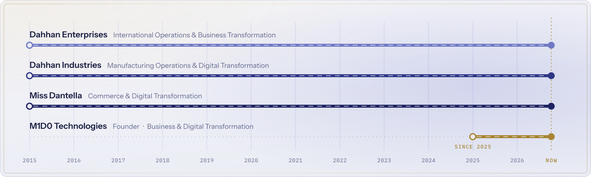
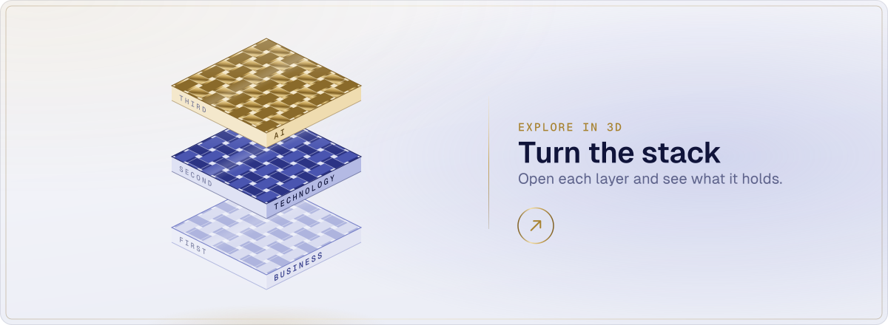

<picture><source media="(prefers-color-scheme: dark) and (max-width: 640px)" srcset="./assets/banner-mobile-dark.svg" /><source media="(max-width: 640px)" srcset="./assets/banner-mobile-light.svg" /><source media="(prefers-color-scheme: dark)" srcset="./assets/banner-dark.svg" /></picture>

## Our companies

<picture><source media="(prefers-color-scheme: dark) and (max-width: 640px)" srcset="./assets/companies-mobile-dark.svg" /><source media="(max-width: 640px)" srcset="./assets/companies-mobile-light.svg" /><source media="(prefers-color-scheme: dark)" srcset="./assets/companies-dark.svg" /></picture>

<a href="https://www.dahhanenterprises.com"><picture><source media="(prefers-color-scheme: dark) and (max-width: 640px)" srcset="./assets/tiles/web-dahhan-enterprises-mob-dark.svg" /><source media="(max-width: 640px)" srcset="./assets/tiles/web-dahhan-enterprises-mob-light.svg" /><source media="(prefers-color-scheme: dark)" srcset="./assets/tiles/web-dahhan-enterprises-desk-dark.svg" /></picture></a><a href="https://www.dahhanindustries.com"><picture><source media="(prefers-color-scheme: dark) and (max-width: 640px)" srcset="./assets/tiles/web-dahhan-industries-mob-dark.svg" /><source media="(max-width: 640px)" srcset="./assets/tiles/web-dahhan-industries-mob-light.svg" /><source media="(prefers-color-scheme: dark)" srcset="./assets/tiles/web-dahhan-industries-desk-dark.svg" /></picture></a><a href="https://www.missdantella.com"><picture><source media="(prefers-color-scheme: dark) and (max-width: 640px)" srcset="./assets/tiles/web-miss-dantella-mob-dark.svg" /><source media="(max-width: 640px)" srcset="./assets/tiles/web-miss-dantella-mob-light.svg" /><source media="(prefers-color-scheme: dark)" srcset="./assets/tiles/web-miss-dantella-desk-dark.svg" /></picture></a><a href="https://www.m1d0.com"><picture><source media="(prefers-color-scheme: dark) and (max-width: 640px)" srcset="./assets/tiles/web-m1d0-mob-dark.svg" /><source media="(max-width: 640px)" srcset="./assets/tiles/web-m1d0-mob-light.svg" /><source media="(prefers-color-scheme: dark)" srcset="./assets/tiles/web-m1d0-desk-dark.svg" /></picture></a>

<a href="https://www.linkedin.com/company/dahhan-enterprises/"><picture><source media="(prefers-color-scheme: dark) and (max-width: 640px)" srcset="./assets/tiles/in-dahhan-enterprises-mob-dark.svg" /><source media="(max-width: 640px)" srcset="./assets/tiles/in-dahhan-enterprises-mob-light.svg" /><source media="(prefers-color-scheme: dark)" srcset="./assets/tiles/in-dahhan-enterprises-desk-dark.svg" /></picture></a><a href="https://www.linkedin.com/company/dahhan-industries/"><picture><source media="(prefers-color-scheme: dark) and (max-width: 640px)" srcset="./assets/tiles/in-dahhan-industries-mob-dark.svg" /><source media="(max-width: 640px)" srcset="./assets/tiles/in-dahhan-industries-mob-light.svg" /><source media="(prefers-color-scheme: dark)" srcset="./assets/tiles/in-dahhan-industries-desk-dark.svg" /></picture></a><a href="https://www.linkedin.com/company/missdantella/"><picture><source media="(prefers-color-scheme: dark) and (max-width: 640px)" srcset="./assets/tiles/in-miss-dantella-mob-dark.svg" /><source media="(max-width: 640px)" srcset="./assets/tiles/in-miss-dantella-mob-light.svg" /><source media="(prefers-color-scheme: dark)" srcset="./assets/tiles/in-miss-dantella-desk-dark.svg" /></picture></a><a href="https://www.linkedin.com/company/m1d0/"><picture><source media="(prefers-color-scheme: dark) and (max-width: 640px)" srcset="./assets/tiles/in-m1d0-mob-dark.svg" /><source media="(max-width: 640px)" srcset="./assets/tiles/in-m1d0-mob-light.svg" /><source media="(prefers-color-scheme: dark)" srcset="./assets/tiles/in-m1d0-desk-dark.svg" /></picture></a>

## What we offer

M1D0 Technologies works for our own companies and for external partners.

<picture><source media="(prefers-color-scheme: dark) and (max-width: 640px)" srcset="./assets/offers-mobile-dark.svg" /><source media="(max-width: 640px)" srcset="./assets/offers-mobile-light.svg" /><source media="(prefers-color-scheme: dark)" srcset="./assets/offers-dark.svg" /></picture>

<picture><source media="(prefers-color-scheme: dark) and (max-width: 640px)" srcset="./assets/industries-mobile-dark.svg" /><source media="(max-width: 640px)" srcset="./assets/industries-mobile-light.svg" /><source media="(prefers-color-scheme: dark)" srcset="./assets/industries-dark.svg" /></picture>

## How we work

Business transformation sits at the intersection of commercial strategy, real-world operations and the systems that connect them.

**Business decisions remain human-led, technology provides the operational foundation, and governed AI accelerates execution without replacing accountability.**

<picture><source media="(prefers-color-scheme: dark) and (max-width: 640px)" srcset="./assets/operating-model-mobile-dark.svg" /><source media="(max-width: 640px)" srcset="./assets/operating-model-mobile-light.svg" /><source media="(prefers-color-scheme: dark)" srcset="./assets/operating-model-dark.svg" /></picture>

<picture><source media="(prefers-color-scheme: dark) and (max-width: 640px)" srcset="./assets/delivery-mobile-dark.svg" /><source media="(max-width: 640px)" srcset="./assets/delivery-mobile-light.svg" /><source media="(prefers-color-scheme: dark)" srcset="./assets/delivery-dark.svg" /></picture>

## Work with M1D0

Six divisions carry the work, and there are three ways to engage.

<picture><source media="(prefers-color-scheme: dark) and (max-width: 640px)" srcset="./assets/divisions-mobile-dark.svg" /><source media="(max-width: 640px)" srcset="./assets/divisions-mobile-light.svg" /><source media="(prefers-color-scheme: dark)" srcset="./assets/divisions-dark.svg" /></picture>

## The founder

My work spans international operations, manufacturing, B2B wholesale and ecommerce—understanding how products move, how suppliers and production interact, how customers are served, and where disconnected processes or systems begin to slow the business down.

I founded M1D0 Technologies around that same principle: translating operational understanding into technology strategy, enterprise architecture and practical transformation.

My role sits across that full picture: defining direction, shaping architecture, coordinating specialist and AI-assisted execution, integrating the pieces and remaining accountable for how the result performs in real operations.

<picture><source media="(prefers-color-scheme: dark) and (max-width: 640px)" srcset="./assets/timeline-mobile-dark.svg" /><source media="(max-width: 640px)" srcset="./assets/timeline-mobile-light.svg" /><source media="(prefers-color-scheme: dark)" srcset="./assets/timeline-dark.svg" /></picture>

## Business first. Technology second. AI third.

<a href="https://mahmutdehhan.github.io/MahmutDehhan/"><picture><source media="(prefers-color-scheme: dark) and (max-width: 640px)" srcset="./assets/motto-mobile-dark.svg" /><source media="(max-width: 640px)" srcset="./assets/motto-mobile-light.svg" /><source media="(prefers-color-scheme: dark)" srcset="./assets/motto-dark.svg" /></picture></a>

## Get in touch

<a href="mailto:mahmutdehhan@dahhanenterprises.com"><picture><source media="(prefers-color-scheme: dark) and (max-width: 640px)" srcset="./assets/contact-mobile-dark.svg" /><source media="(max-width: 640px)" srcset="./assets/contact-mobile-light.svg" /><source media="(prefers-color-scheme: dark)" srcset="./assets/contact-dark.svg" /></picture></a>

<a href="mailto:mahmutdehhan@dahhanenterprises.com?subject=Strategic%20Partnerships"><picture><source media="(prefers-color-scheme: dark) and (max-width: 640px)" srcset="./assets/tiles/intent-1-mob-dark.svg" /><source media="(max-width: 640px)" srcset="./assets/tiles/intent-1-mob-light.svg" /><source media="(prefers-color-scheme: dark)" srcset="./assets/tiles/intent-1-desk-dark.svg" /></picture></a><a href="mailto:mahmutdehhan@dahhanenterprises.com?subject=Manufacturing%20%26%20Private%20Label"><picture><source media="(prefers-color-scheme: dark) and (max-width: 640px)" srcset="./assets/tiles/intent-2-mob-dark.svg" /><source media="(max-width: 640px)" srcset="./assets/tiles/intent-2-mob-light.svg" /><source media="(prefers-color-scheme: dark)" srcset="./assets/tiles/intent-2-desk-dark.svg" /></picture></a><a href="mailto:mahmutdehhan@dahhanenterprises.com?subject=Business%20%26%20Digital%20Transformation"><picture><source media="(prefers-color-scheme: dark) and (max-width: 640px)" srcset="./assets/tiles/intent-3-mob-dark.svg" /><source media="(max-width: 640px)" srcset="./assets/tiles/intent-3-mob-light.svg" /><source media="(prefers-color-scheme: dark)" srcset="./assets/tiles/intent-3-desk-dark.svg" /></picture></a><a href="mailto:mahmutdehhan@dahhanenterprises.com?subject=Systems%20%26%20Technology%20Projects"><picture><source media="(prefers-color-scheme: dark) and (max-width: 640px)" srcset="./assets/tiles/intent-4-mob-dark.svg" /><source media="(max-width: 640px)" srcset="./assets/tiles/intent-4-mob-light.svg" /><source media="(prefers-color-scheme: dark)" srcset="./assets/tiles/intent-4-desk-dark.svg" /></picture></a>

<a href="https://www.linkedin.com/in/mahmutdehhan/"><picture><source media="(prefers-color-scheme: dark) and (max-width: 640px)" srcset="./assets/tiles/link-linkedin-mob-dark.svg" /><source media="(max-width: 640px)" srcset="./assets/tiles/link-linkedin-mob-light.svg" /><source media="(prefers-color-scheme: dark)" srcset="./assets/tiles/link-linkedin-desk-dark.svg" /></picture></a><a href="https://github.com/M1D0-Technologies"><picture><source media="(prefers-color-scheme: dark) and (max-width: 640px)" srcset="./assets/tiles/link-github-mob-dark.svg" /><source media="(max-width: 640px)" srcset="./assets/tiles/link-github-mob-light.svg" /><source media="(prefers-color-scheme: dark)" srcset="./assets/tiles/link-github-desk-dark.svg" /></picture></a>

© 2026 Dahhan Enterprises LLC. All rights reserved.
